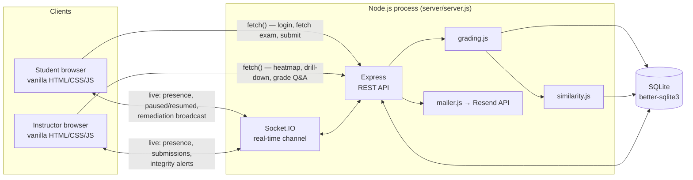
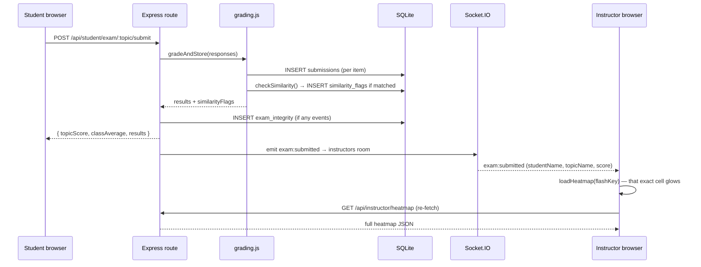

# Mastery Pulse — Architecture & Technical Documentation

This document is the complete technical reference for Mastery Pulse: what it is, how the client-server architecture works end to end, the full API surface, the database schema, and the design decisions behind it. The top-level [README](../README.md) is the quick-start and feature tour; this is the deep dive — the document to hand a grader, a new contributor, or your own future self.

## Table of contents

1. [What this project is](#what-this-project-is)
2. [System architecture](#system-architecture)
3. [Technology stack](#technology-stack)
4. [Database schema](#database-schema)
5. [REST API reference](#rest-api-reference)
6. [Socket.IO event reference](#socketio-event-reference)
7. [Data flow: from an answer to a live dashboard update](#data-flow-from-an-answer-to-a-live-dashboard-update)
8. [The exam integrity system](#the-exam-integrity-system)
9. [Where the data comes from](#where-the-data-comes-from)
10. [Testing strategy](#testing-strategy)
11. [Deployment](#deployment)
12. [Design decisions worth defending](#design-decisions-worth-defending)
13. [Known limitations](#known-limitations)

---

## What this project is

Mastery Pulse is a real-time exam platform for a graduate IT/CS course spanning **Cybersecurity, Web Technology, Networking, Cloud Computing, and Full Stack Development**. It was built for the course topic **"Designing a Client-Server Architecture for Web Applications"** — which is why the architecture itself, not just the exam-taking UI, is the point of the project.

Two roles, two completely separate client applications, one server:
- **Students** take mixed-format exams (quiz / task / short-answer) per topic, one question at a time, no going back.
- **Instructors** watch a live weak-topic heatmap update *while students are still answering* — not after a page refresh — plus misconception aggregation, remediation, and four independent exam-integrity signals.

## System architecture

Two independent transports carry different kinds of traffic on purpose:
- **REST (Express)** for anything request/response shaped: logging in, fetching an exam, submitting answers, grading a Q&A response, pulling the heatmap.
- **Socket.IO** for anything that needs to reach an already-open browser tab without it asking: a heatmap cell updating the instant another student submits, a presence chip advancing as a student answers, an exam pausing/resuming, a remediation banner appearing.

Both are served from the same Node process and the same port — this is a monolith by design, appropriate for the project's scope, not a microservices split that would add real deployment complexity for no benefit here.

## Technology stack

| Layer | Technology | Why |
|---|---|---|
| Runtime | Node.js | |
| Web framework | Express | REST routes, static file serving |
| Real-time | Socket.IO | WebSocket channel with automatic fallback/reconnection |
| Database | SQLite via `better-sqlite3` | Zero-setup, single-file, synchronous (no connection-pool overhead for this workload) |
| Auth | JSON Web Tokens (`jsonwebtoken`) | Stateless, carries `role` as a claim so the server never has to look up a session |
| Password hashing | `bcryptjs` | |
| Validation | `zod` | Every request body is schema-checked before a route handler runs |
| Rate limiting | `express-rate-limit` | Caps login attempts and exam submissions |
| Env loading | `dotenv` | Loads `.env` for local dev only (Render injects real env vars directly) |
| Frontend | Vanilla HTML/CSS/JS — **no framework** | A deliberate choice: proves direct command of the client-server boundary (`fetch`, DOM, a real Socket.IO client) rather than a framework abstracting it away |
| 3D graphics | Three.js (landing page only) | The rotating network-graph background |
| Face detection | MediaPipe Face Landmarker (student exam only) | Runs entirely client-side via WebAssembly — see [integrity system](#the-exam-integrity-system) |
| Email | Resend (HTTP API via `fetch`, no SDK) | Webcam-alert notifications |
| Testing | Jest, Supertest, `socket.io-client` | Real HTTP/socket connections against the real app, not mocks |
| CI | GitHub Actions | Full suite on every push |
| Deployment | Render (free tier), `render.yaml` Blueprint | |

## Database schema

Nine tables, all created and migrated in `server/db.js`:

| Table | Purpose | Key columns |
|---|---|---|
| `users` | Every login (student or instructor) | `username`, `password_hash`, `role`, `display_name` |
| `topics` | The five exam topics | `key`, `name` |
| `items` | Every quiz/task/qa question | `topic_id`, `type`, `prompt`, `options`, `correct_index`, `misconceptions`, `keywords` |
| `submissions` | One row per item per exam attempt | `user_id`, `topic_id`, `item_id`, `type`, `selected_index`, `response_text`, `auto_score`, `misconception_tag`, `confidence`, `status`, `exam_run` |
| `remediations` | Every "Remediate" click | `topic_id`, `item_ids`, `message`, `before_avg` |
| `exam_integrity` | Browser-detected tab-switch/fullscreen-exit events | `user_id`, `topic_id`, `exam_run`, `events` (JSON array) |
| `similarity_flags` | Cross-student text-overlap matches | `submission_id`, `matched_submission_id`, `similarity` |
| `webcam_alerts` | Webcam attention strikes (3rd+) | `user_id`, `topic_id`, `exam_run`, `strike_count`, `snapshot`, `resolved` |

`misconceptions` and `keywords` on `items`, `options` on `items`, and `events` on `exam_integrity` are stored as JSON strings in TEXT columns (SQLite has no native array/JSON type) and parsed with `parseJSON()` on read.

## REST API reference

All `/api/student/*` routes require a student JWT; all `/api/instructor/*` routes require an instructor JWT (`requireRole()` middleware in `server/auth.js`). Neither role can call the other's routes — verified directly in `tests/api.test.js`, not just asserted in a comment.

| Method | Path | Purpose |
|---|---|---|
| GET | `/health` | Unauthenticated uptime check |
| POST | `/api/auth/student/login` | Student login → JWT |
| POST | `/api/auth/instructor/login` | Instructor login → JWT |
| GET | `/api/student/topics` | List topics + this student's score in each |
| GET | `/api/student/exam/:topicKey` | Fetch an exam's items (no answers included) |
| POST | `/api/student/exam/:topicKey/submit` | Submit responses; triggers grading, similarity check, live broadcasts |
| GET | `/api/student/remediation` | Recent remediation messages for this student |
| GET | `/api/student/remediation/:id` | Fetch a remediation's practice items as an exam |
| GET | `/api/instructor/heatmap` | Students × topics score grid, with misconception/flag/webcam-flag annotations |
| GET | `/api/instructor/misconceptions` | Top misconceptions across all topics |
| GET | `/api/instructor/remediation-impact` | Before/after class average per remediation sent |
| GET | `/api/instructor/integrity` | Recent tab-switch events + similarity flags |
| GET | `/api/instructor/webcam-alerts` | Recent webcam strikes, with resolved/unresolved state |
| GET | `/api/instructor/presence` | Snapshot of who's online and mid-exam right now |
| GET | `/api/instructor/detail/:studentId/:topicKey` | Full drill-down: every submission, integrity event, similarity flag, webcam alert for that student/topic |
| GET | `/api/instructor/pending-qa` | Queue of ungraded short-answer responses |
| POST | `/api/instructor/review` | Grade a pending Q&A submission |
| POST | `/api/instructor/remediate` | Broadcast a remediation for a topic |

## Socket.IO event reference

Every student socket joins the `students` room on connect (broadcast to all students); every instructor socket joins `instructors`.

| Event | Direction | Purpose |
|---|---|---|
| `presence:online` | server → both | Live online headcount |
| `exam:start` | student → server | Announces an exam attempt has begun |
| `exam:progress` | student → server | Question index advanced |
| `exam:answer` | student → server | A quiz option was picked — graded instantly server-side |
| `presence:progress` | server → instructors | Live per-student progress + quiz correctness trail |
| `presence:clear` | server → instructors | A student finished or disconnected |
| `exam:submitted` | server → instructors | A full exam was submitted and graded (`forcedFail: true` when it was ended by a webcam strike) |
| `exam:webcamAlert` | student → server | A 3rd+ webcam attention strike — the client force-submits the exam as a hard fail right after emitting this |
| `integrity:similarity` | server → instructors | A cross-student text-overlap flag |
| `integrity:webcamAlert` | server → instructors | A webcam strike, live — the exam it ended has already failed by the time this arrives |
| `qa:reviewed` | server → instructors | A Q&A submission was just graded |
| `remediation:new` | server → students | A remediation was broadcast |

## Data flow: from an answer to a live dashboard update

The instructor's browser never polls. `loadHeatmap()` only runs in response to a socket event telling it something changed — and it's told *which* cell changed, so it can flash exactly that one instead of silently re-rendering the whole table.

## The exam integrity system

Four independent signals, each explicitly framed as "detected and logged," never "prevented" or "proven" — a deliberate stance against overclaiming what a browser can actually guarantee:

1. **One-way answer lock** — the exam UI renders one question at a time; moving to the next question finalizes the previous one client-side before it's ever sent to the server. No API exists to edit a past answer.
2. **Integrity event trail** — `visibilitychange` and `fullscreenchange` listeners log tab-switches and fullscreen exits with timestamps, submitted alongside the exam and shown to the instructor per submission.
3. **Cross-student similarity detection** — every free-text answer is compared, the instant it's submitted, against every other student's answer to the same question using word-set Jaccard similarity (`server/similarity.js`) — plain, explainable, deterministic math, not a black-box "AI detector." A pair above 60% overlap is flagged.
4. **Webcam attention monitoring** — MediaPipe's Face Landmarker runs entirely client-side (no video ever leaves the browser) estimating head yaw and eye closure. Strikes 1–2 show the student a private on-screen reminder. Strike 3 **ends the exam immediately as a hard fail (0%)** — no pause, no instructor approval step. The instructor is notified with a timestamp, a count, and one still-frame snapshot, but by the time they see it the exam is already over. This is the one integrity signal in the system where the heuristic itself is the final word, not a human reviewing it first — a deliberate, known tradeoff (see [Known limitations](#known-limitations)).

## Where the data comes from

Everything on this platform is either **hand-authored content** (`server/topics/*.json` — real quiz/task/Q&A items with real misconception tags, written for this project) or **live-generated activity** (real exam submissions, or `npm run seed:demo` inserting realistic-but-synthetic activity directly into the database for demo purposes). **Nothing comes from Kaggle, a public dataset, or any external data source.**

## Testing strategy

65 tests across 7 suites (`npm test`), run on every push via [`.github/workflows/ci.yml`](../.github/workflows/ci.yml):

- **`grading.test.js`** — unit tests for scoring logic against real seeded content.
- **`auth.test.js`** — login paths and role-based middleware rejection.
- **`api.test.js`** — full REST integration via Supertest against the real Express app, including the cross-role-rejection acceptance check.
- **`realtime.test.js`** — real HTTP server + real `socket.io-client` connections proving the live channel actually works, not just that routes return 200.
- **`similarity.test.js`** — calibrates the Jaccard threshold against real copy-paste vs. independently-worded text.
- **`integrity.test.js`** — the full similarity + tab-switch flow end to end.
- **`webcam-alert.test.js`** — the strike-detection flow live over real sockets, and the forced-fail submit path: every submission in that attempt scored 0% and marked graded (never left pending review), the live `exam:submitted` broadcast carrying `forcedFail: true`, and a normal submit proving it's unaffected.

## Deployment

Render (free tier), via `render.yaml` as a Blueprint. See the [README's deployment section](../README.md#deploying-to-render-free-tier) for the operational checklist (database resets on every deploy, the two optional email env vars, the 15-minute idle spin-down).

## Design decisions worth defending

- **No ORM.** Raw SQL via `better-sqlite3`'s prepared statements — a course about client-server architecture benefits from the actual queries being visible, not hidden behind a query builder.
- **No frontend framework.** See [Technology stack](#technology-stack) above — this is a stated choice, not an oversight.
- **Two separate login flows and two separate static apps**, not one app with a role toggle — mirrors how a real institution would actually deploy this (different subdomains/paths, different UI, different permissions), and it makes the access-control boundary something you can point at in `server/auth.js` rather than a client-side `if`.
- **No ML/"AI" model doing the actual integrity judgment.** The similarity detector is Jaccard math; the webcam signal is a documented, explainable heuristic. Both are explicitly not claimed as proof of anything — a deliberate rejection of black-box "AI-detector" services (Turnitin, GPTZero, etc.), which are unreliable and have a track record of false accusations against genuine work.
- **Every other integrity signal is "detect and log," never a verdict** — the answer lock, event trail, and similarity detection all leave the actual judgment to the instructor. The webcam hard-fail is the deliberate exception, stated plainly as such rather than glossed over.

## Known limitations

Stated here plainly, the same honesty standard applied throughout the UI copy and README:

- The webcam signal is head-pose/eye-closure *approximation*, not eye-tracking — lighting, camera angle, and glasses all affect it. The 3rd strike acts on that approximation directly, with no human check before the exam is scored 0% — a false positive genuinely fails a real attempt.
- No persistent disk on Render's free tier — the database resets on every deploy.
- Free-tier Render spins down after 15 minutes idle.
- No password reset flow, no multi-instructor role separation (any instructor account can do everything), and no i18n — all reasonable scope cuts for a course project, not oversights.
